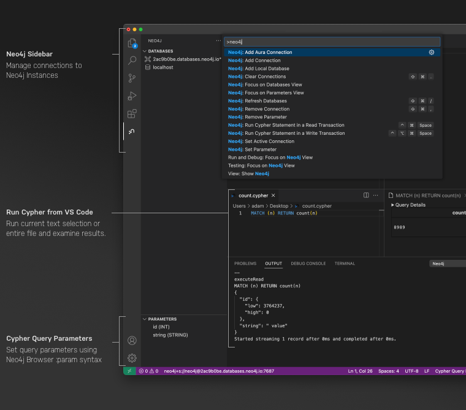

# Neo4j VS Code Extension

The Neo4j VS Code Extension allows you to manage connections and run Cypher without leaving VS Code.

## Features

* Manage Neo4j connections in the Neo4j Sidebar
* Run Cypher statements in read or write transactions
* Highlight individual Cypher statements in your code and run with
* Supercharge your Cypher with code snippets

## Roadmap

* Built-in Cypher syntax highlighting and formatting
* Better result handling
* Open your connection in Workspace, Bloom, Browser and more...
* More code snippets

<!-- ## Release Notes

Users appreciate release notes as you update your extension.

### 1.0.0 -->

## Feedback

If you have any comments, feedback or feature requests please feel free to open an Issue.  PRs are also welcome.
